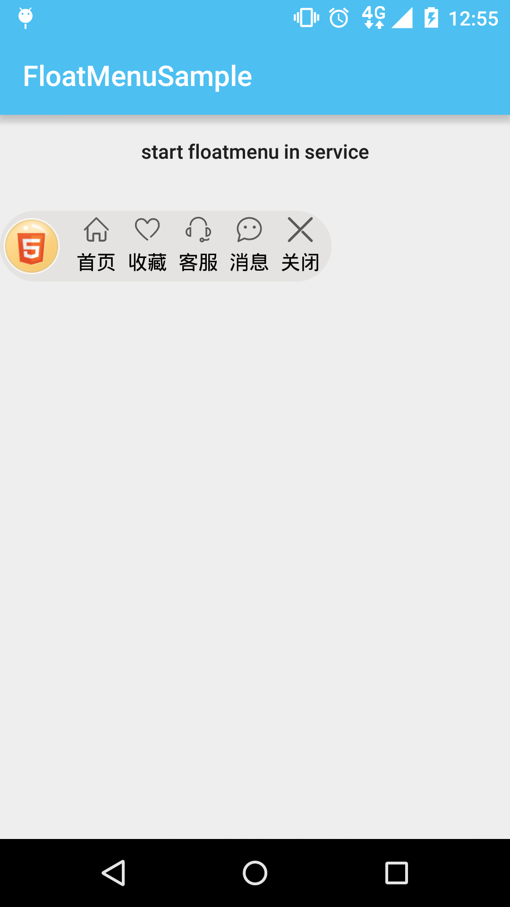
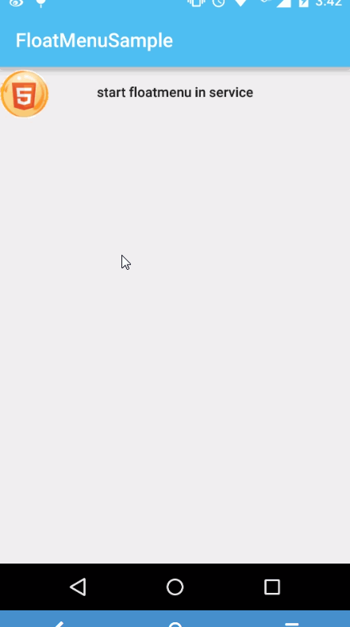
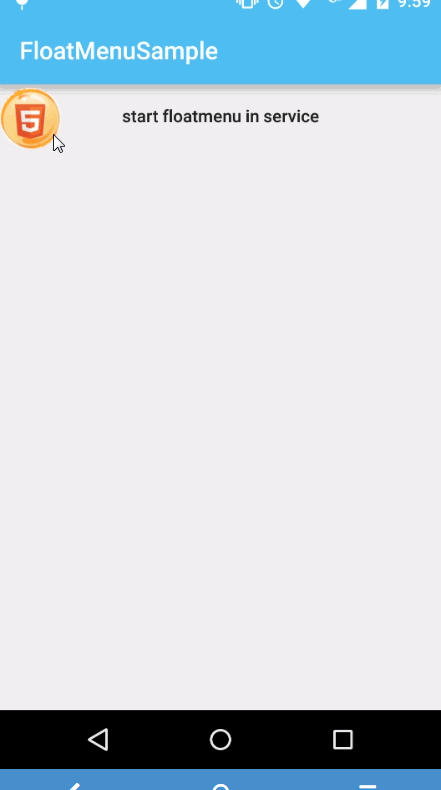

# FloatMenuSample

## to use

	compile 'com.yw.game.floatmenu:FloatMenu:0.0.2'

a float menu in game

android float menu in app or launcher

##compatibility & permissions
 api 9 - api 23

api level <19 need permissions:

	 <uses-permission android:name="android.permission.SYSTEM_ALERT_WINDOW" />

api level >=19 no permissions

for use：

	@Override
    public void onCreate() {
        super.onCreate();
        mFloatMenu = new FloatMenu.Builder(this)
                .floatLoader(R.drawable.yw_anim_background)
                .floatLogo(R.drawable.yw_image_float_logo)
                .addMenuItem(android.R.color.transparent, R.drawable.yw_menu_account, Const.MENU_ITEMS[0], android.R.color.black, this)
                .addMenuItem(android.R.color.transparent, R.drawable.yw_menu_favour, Const.MENU_ITEMS[1], android.R.color.black, this)
                .addMenuItem(android.R.color.transparent, R.drawable.yw_menu_fb, Const.MENU_ITEMS[2], android.R.color.black, this)
                .addMenuItem(android.R.color.transparent, R.drawable.yw_menu_msg, Const.MENU_ITEMS[3], android.R.color.black, this)
                .addMenuItem(android.R.color.transparent, R.drawable.yw_menu_close, Const.MENU_ITEMS[4], android.R.color.black, this)
                .menuBackground(R.drawable.yw_menu_bg)
                .onMenuActionListner(this)
                .build();
        mFloatMenu.show();
    }

 	public void showFloat() {
        if (mFloatMenu != null)
            mFloatMenu.show();
    }

    public void hideFloat() {
        if (mFloatMenu != null) {
            mFloatMenu.hide();
        }
    }

    public void destroyFloat() {
        hideFloat();
        if (mFloatMenu != null) {
            mFloatMenu.destroy();
        }
        mFloatMenu = null;
    }

	 private void showRed() {
        if (!hasNewMsg) {
            mFloatMenu.changeLogo(R.drawable.yw_image_float_logo, R.drawable.yw_menu_msg, 3);
        } else {
            mFloatMenu.changeLogo(R.drawable.yw_image_float_logo_red, R.drawable.yw_menu_msg_red, 3);
        }
    }

###see sample [FloatMenuService](https://github.com/fanOfDemo/FloatMenuSample/blob/master/FloatMenuDemo%2Fsrc%2Fmain%2Fjava%2Fcom%2Fyw%2Fgame%2Ffloatmenu%2Fdemo%2FFloatMenuService.java)

##demo

##reference 

 [http://www.jianshu.com/p/167fd5f47d5c](http://www.jianshu.com/p/167fd5f47d5c) 

 [http://www.jianshu.com/p/634cd056b90c](http://www.jianshu.com/p/634cd056b90c) 

 [http://www.liaohuqiu.net/cn/posts/android-windows-manager/](http://www.liaohuqiu.net/cn/posts/android-windows-manager/) 

##License

   Licensed under the Apache License, Version 2.0 (the "License");
   you may not use this file except in compliance with the License.
   You may obtain a copy of the License at

     http://www.apache.org/licenses/LICENSE-2.0

   Unless required by applicable law or agreed to in writing, software
   distributed under the License is distributed on an "AS IS" BASIS,
   WITHOUT WARRANTIES OR CONDITIONS OF ANY KIND, either express or implied.
   See the License for the specific language governing permissions and
   limitations under the License.

