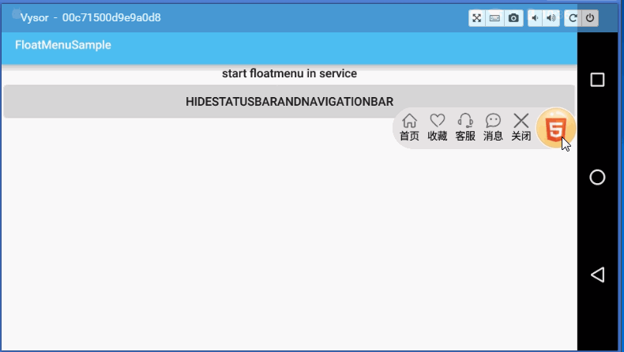
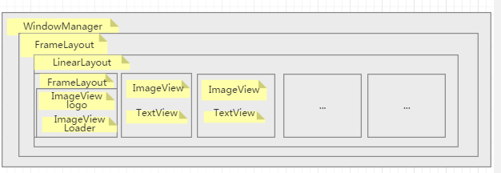

# FloatMenuSample

[游戏产品持续更新](http://xs.qidian.com/Home/Pc/Index/index)

欢迎关注 [https://github.com/crosg ](https://github.com/crosg)	

[crosg/FloatMenuSample](https://github.com/crosg/FloatMenuSample)
transfer from [yiming/FloatMenuSample](https://github.com/fanOfDemo/FloatMenuSample)

##GIF

	

##  GRADLE:

	compile 'com.yw.game.floatmenu:FloatMenu:@lastVersion'

Download [aar](https://dl.bintray.com/fanofdemo/maven/com/yw/game/floatmenu/FloatMenu/0.0.5/FloatMenu-1.1.0.aar)	

Download [jar](https://bintray.com/fanofdemo/maven/download_file?file_path=com%2Fyw%2Fgame%2Ffloatmenu%2FFloatMenu%2F1.1.0%2FFloatMenu-1.1.0-sources.jar)

android float menu in app or launcher

##权限 compatibility & permissions 

兼容android2.3到android7.0（7.0已测）
 api 9 - api 24

api level <19 need permissions:

	 <uses-permission android:name="android.permission.SYSTEM_ALERT_WINDOW" />

api level >=19 no permissions

for use：

	@Override
    public void onCreate() {
        super.onCreate();
        ArrayList<MenuItem> mMenuItems = new ArrayList<>();
        for (int i = 0; i < menuIcons.length; i++) {
            mMenuItems.add(new MenuItem(menuIcons[i], Const.MENU_ITEMS[i], android.R.color.black, this));
        }
        mFloatMenu = new FloatMenu.Builder(this).menuItems(mMenuItems).build();
        mFloatMenu.show();

    }

 	public void showFloat() {
        if (mFloatMenu != null)
            mFloatMenu.show();
    }

    public void hideFloat() {
        if (mFloatMenu != null) {
            mFloatMenu.hide();
        }
    }

    public void destroyFloat() {
        hideFloat();
        if (mFloatMenu != null) {
            mFloatMenu.destroy();
        }
        mFloatMenu = null;
    }

	 private void showRed() {
        if (!hasNewMsg) {
            mFloatMenu.changeLogo(R.drawable.yw_image_float_logo, R.drawable.yw_menu_msg, 3);
        } else {
            mFloatMenu.changeLogo(R.drawable.yw_image_float_logo_red, R.drawable.yw_menu_msg_red, 3);
        }
    }

使用示例
see sample 

[FloatMenuService](https://github.com/fanOfDemo/FloatMenuSample/blob/master/FloatMenuDemo%2Fsrc%2Fmain%2Fjava%2Fcom%2Fyw%2Fgame%2Ffloatmenu%2Fdemo%2FFloatMenuService.java)

[FloatMenuInServiceActivity](https://github.com/fanOfDemo/FloatMenuSample/blob/master/FloatMenuDemo/src/main/java/com/yw/game/floatmenu/demo/FloatMenuInServiceActivity.java)

修改菜单的样式，只需要更改[res/layout/layout_yw_menu_item.xml](https://github.com/crosg/FloatMenuSample/blob/master/FloatMenu/src/main/res/layout/layout_yw_menu_item.xml) 对应的文字大小，图片大小，背景颜色等等

###设计思路

* 设计图：

* 实现悬浮球占位到虚拟按键：

   		mWmParams.flags = WindowManager.LayoutParams.FLAG_NOT_FOCUSABLE | WindowManager.LayoutParams.FLAG_LAYOUT_IN_SCREEN;

##更新日志
UPDATE LOG:
	
* 0.0.1 init lib
* 0.0.2 修复bug
* 0.0.3 增加动态切换动画的接口
* 0.0.4 解决加载动画时出现的bug
* 0.0.5 修改开源协议
* 0.0.6 增加首次启动悬浮球透明度和变大动画
*	0.0.7	解决动画加载旋转不居中的问题
*	0.0.8	通过设置margin自动缩小悬浮球logo的大小
*	0.0.9 修复bug
*	1.0.0 	[解决当悬浮球在右边时菜单位置错乱](https://github.com/crosg/FloatMenuSample/blob/master/FloatMenu/src/main/java/com/yw/game/floatmenu/FloatMenu.java)
*	1.1.0   [增加悬浮球所在service的代码样例](https://github.com/fanOfDemo/FloatMenuSample/blob/master/FloatMenuDemo/src/main/java/com/yw/game/floatmenu/demo/FloatMenuManager.java)

*	1.1.1 [修复悬浮球不对虚拟按键占位问题](https://github.com/crosg/FloatMenuSample/blob/master/pickture/201606161036.gif)
*	todo 1.1.2 [issues/22](https://github.com/crosg/FloatMenuSample/issues/22) ,[完善代码注释(部分)](https://github.com/crosg/FloatMenuSample/blob/master/FloatMenu/src/main/java/com/yw/game/floatmenu/FloatMenu.java)，view构造全部使用xml,便于代码的易维护可扩展性，悬浮view使用xml导入，悬浮菜单使用xml导入，支持菜单item的功能扩展，颜色大小，分割线等都可以在xml布局中调整

##License

	
	Copyright (c) 2016, Shanghai YUEWEN Information Technology Co., Ltd. 
	All rights reserved.
	Redistribution and use in source and binary forms, with or without modification, are permitted provided that the following conditions are met:
	
	* Redistributions of source code must retain the above copyright notice, this list of conditions and the following disclaimer.
	* Redistributions in binary form must reproduce the above copyright notice, this list of conditions and the following disclaimer in the documentation and/or other materials provided with the distribution.
	* Neither the name of Shanghai YUEWEN Information Technology Co., Ltd. nor the names of its contributors may be used to endorse or promote products derived from this software without specific prior written permission.
	
	THIS SOFTWARE IS PROVIDED BY SHANGHAI YUEWEN INFORMATION TECHNOLOGY CO., LTD. AND CONTRIBUTORS "AS IS" AND ANY EXPRESS OR IMPLIED WARRANTIES, INCLUDING, BUT NOT LIMITED TO, THE IMPLIED WARRANTIES OF MERCHANTABILITY AND FITNESS FOR A PARTICULAR PURPOSE ARE DISCLAIMED. IN NO EVENT SHALL THE REGENTS AND CONTRIBUTORS BE LIABLE FOR ANY DIRECT, INDIRECT, INCIDENTAL, SPECIAL, EXEMPLARY, OR CONSEQUENTIAL DAMAGES (INCLUDING, BUT NOT LIMITED TO, PROCUREMENT OF SUBSTITUTE GOODS OR SERVICES; LOSS OF USE, DATA, OR PROFITS; OR BUSINESS INTERRUPTION) HOWEVER CAUSED AND ON ANY THEORY OF LIABILITY, WHETHER IN CONTRACT, STRICT LIABILITY, OR TORT (INCLUDING NEGLIGENCE OR OTHERWISE) ARISING IN ANY WAY OUT OF THE USE OF THIS SOFTWARE, EVEN IF ADVISED OF THE POSSIBILITY OF SUCH DAMAGE.

