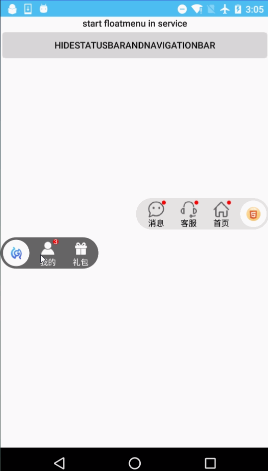

# FloatMenuSample

[  ]

[crosg/FloatMenuSample](https://github.com/crosg/FloatMenuSample)
transfer from [yiming/FloatMenuSample](https://github.com/fanOfDemo/FloatMenuSample)

 
## GIF

	

##  GRADLE:

	compile 'com.yw.game.floatmenu:FloatMenu:2.0.1'

android float menu in app 

## 权限 compatibility & permissions 

 无权限需求，支持 api 11 ++

for use：

	

使用示例
see sample 

[MainActivity](https://github.com/fanOfDemo/FloatMenuSample/blob/master/FloatMenuDemo/src/main/java/com/yw/game/floatmenu/demo/MainActivity.java)

1：

    mFloatMenu = new FloatLogoMenu.Builder()
                    .withActivity(mActivity)
                  //  .withContext(mActivity.getApplication())//这个在7.0（包括7.0）以上以及大部分7.0以下的国产手机上需要用户授权，需要搭配<uses-permission android:name="android.permission.SYSTEM_ALERT_WINDOW"/>
                    .logo(BitmapFactory.decodeResource(getResources(),R.drawable.yw_game_logo))
                    .drawCicleMenuBg(true)
                    .backMenuColor(0xffe4e3e1)
                    .setBgDrawable(this.getResources().getDrawable(R.drawable.yw_game_float_menu_bg))
                    //这个背景色需要和logo的背景色一致
                    .setFloatItems(itemList)
                    .defaultLocation(FloatLogoMenu.RIGHT)
                    .drawRedPointNum(false)
                    .showWithListener(new FloatMenuView.OnMenuClickListener() {
                        @Override
                        public void onItemClick(int position, String title) {
                            Toast.makeText(MainActivity.this, "position " + position + " title:" + title + " is clicked.", Toast.LENGTH_SHORT).show();
                        }

                        @Override
                        public void dismiss() {

                        }
                    });

2：

    mFloatMenu = new FloatLogoMenu.Builder()
            		.withActivity(mActivity)
                    .logo(R.drawable.yw_image_float_logo)
                    .backMenuColor(0xffe4e3e1)
                    .drawCicleMenuBg(true)
                    .setFloatItems(itemList)
                    .defaultLocation(FloatLogoMenu.RIGHT)
                    .drawRedPointNum(false)
                    .showWithListener(new FloatMenuView.OnMenuClickListener() {
        @Override
        public void onItemClick(int position, String title) {
            Toast.makeText(MainActivity.this, "position " + position + " title:" + title + " is clicked.", Toast.LENGTH_SHORT).show();
        }

        @Override
        public void dismiss() {

        }
    });

3： 以下方法供自定义:

  可将 [BaseFloatDailog](https://github.com/crosg/FloatMenuSample/blob/master/FloatMenu/src/main/java/com/yw/game/floatmenu/customfloat/BaseFloatDailog.java) 文件拷贝出来直接使用

        通过实现接口的形式自定义 
        BaseFloatDailog  mBaseFloatDailog = new BaseFloatDailog.FloatDialogImp(this, new BaseFloatDailog.GetViewCallback() {});

        或通过继承的形式自定义：
        
         public class MyFloatDialog extends BaseFloatDailog {
            ....         
        }

## 更新日志
UPDATE LOG:
	
* 1.+ 桌面或应用内悬浮窗 （removed）

		compile 'com.yw.game.floatmenu:FloatMenu:1.0.0'

* 2.0.0 重构版，应用内悬浮窗

		compile 'com.yw.game.floatmenu:FloatMenu:2.0.0'

		 //2.0.0版使用windows.addContentView接口，在unity3D游戏引擎需要开启该选项
            <meta-data android:name="unityplayer.ForwardNativeEventsToDalvik" android:value="true" />

* 2.0.1 可选择支持出现在桌面（需权限），应用内无权限需要。

        移除windows.addContentView接口
        出现在桌面的话需要：
        使用全局上下文  .withContext(mService.getApplication())
        并配合权限 <uses-permission android:name="android.permission.SYSTEM_ALERT_WINDOW" />

## License

	
	Copyright (c) 2016, Shanghai YUEWEN Information Technology Co., Ltd. 
	All rights reserved.
	Redistribution and use in source and binary forms, with or without modification, are permitted provided that the following conditions are met:
	
	* Redistributions of source code must retain the above copyright notice, this list of conditions and the following disclaimer.
	* Redistributions in binary form must reproduce the above copyright notice, this list of conditions and the following disclaimer in the documentation and/or other materials provided with the distribution.
	* Neither the name of Shanghai YUEWEN Information Technology Co., Ltd. nor the names of its contributors may be used to endorse or promote products derived from this software without specific prior written permission.
	
	THIS SOFTWARE IS PROVIDED BY SHANGHAI YUEWEN INFORMATION TECHNOLOGY CO., LTD. AND CONTRIBUTORS "AS IS" AND ANY EXPRESS OR IMPLIED WARRANTIES, INCLUDING, BUT NOT LIMITED TO, THE IMPLIED WARRANTIES OF MERCHANTABILITY AND FITNESS FOR A PARTICULAR PURPOSE ARE DISCLAIMED. IN NO EVENT SHALL THE REGENTS AND CONTRIBUTORS BE LIABLE FOR ANY DIRECT, INDIRECT, INCIDENTAL, SPECIAL, EXEMPLARY, OR CONSEQUENTIAL DAMAGES (INCLUDING, BUT NOT LIMITED TO, PROCUREMENT OF SUBSTITUTE GOODS OR SERVICES; LOSS OF USE, DATA, OR PROFITS; OR BUSINESS INTERRUPTION) HOWEVER CAUSED AND ON ANY THEORY OF LIABILITY, WHETHER IN CONTRACT, STRICT LIABILITY, OR TORT (INCLUDING NEGLIGENCE OR OTHERWISE) ARISING IN ANY WAY OUT OF THE USE OF THIS SOFTWARE, EVEN IF ADVISED OF THE POSSIBILITY OF SUCH DAMAGE.

